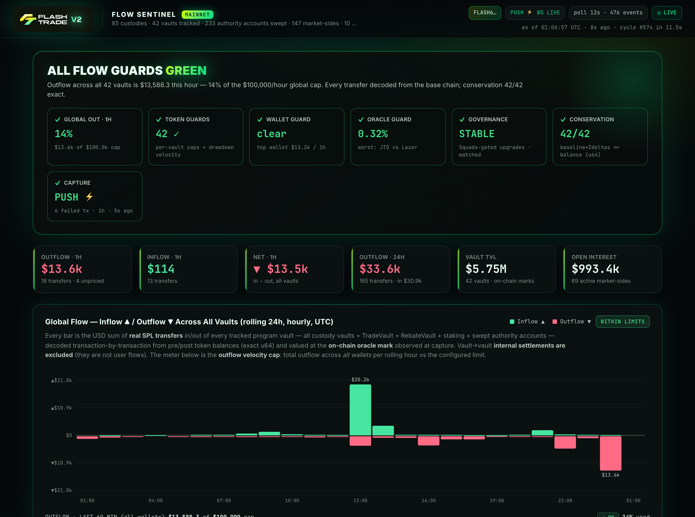
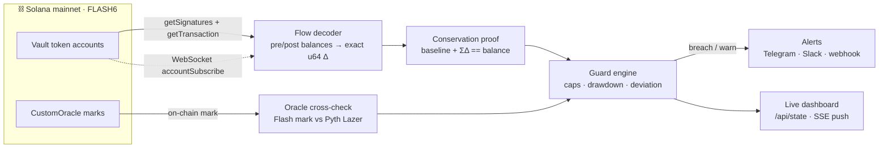

<div align="center">

# 🛰️ FLASH FLOW SENTINEL

### A public, real-time watchtower over every vault on Flash Trade.

**Every dollar in. Every dollar out. Proven against the chain — to the raw integer.**

[](https://solana.com)
[](https://nodejs.org)
[](https://pyth.network)
[](#-no-synthetic-data)
[](LICENSE)
[](https://flash-flow-sentinel.vercel.app)

**[🔗 Live Dashboard](https://flash-flow-sentinel.vercel.app)** &nbsp;·&nbsp; **[🔔 Alerts Channel](https://t.me/FlashFlowSentinel)**



</div>

---

## Why this exists

Oracle manipulation is how DeFi's biggest drains happen — a poisoned price, and a vault empties in minutes. The usual answer is *"trust our dashboard."*

Flash Flow Sentinel replaces trust with **proof**. It watches every vault on-chain in real time, cross-checks every oracle mark against an independent feed, and alarms the instant an outflow breaks the rules — **in public**. You don't have to trust the exchange. Watch the chain yourself.

> **Don't trust. Verify.**

---

## The proof — why it can't lie

For every vault, every cycle, in raw `u64` with **zero tolerance**:

```
baseline_balance  +  Σ observed_tx_deltas  ==  live_vault_balance
```

Each delta is the exact integer difference of the pre/post token balances **inside the transaction**. If a transfer were ever missed, the residual would be non-zero — a brief mid-cycle landing shows as `SYNCING` and must clear next cycle; a persistent mismatch raises `DRIFT` and rebases with an audit trail. The monitor can't fudge a number: the chain grades its homework, continuously.

`verify.cjs` goes further — it re-fetches random events straight from the chain and recomputes every window, bucket, and utilization from the raw event list. **22/22 checks green.**

---

## The guards

| Guard | Default | What it catches |
|---|---|---|
| 🌊 **Global outflow cap** | `$100k` / rolling hour | mass exfiltration across *all* wallets |
| 👛 **Per-wallet cap** | `$50k` / hour | a single address draining |
| 🎯 **Per-token cap** | off (global still applies) | one market bleeding |
| 📉 **Vault drawdown velocity** | `20%` / hour | a vault emptying fast — the drain pattern |
| 🔮 **Oracle deviation** | `1.5%` | Flash mark diverging from an independent Pyth Lazer feed (manipulation) |
| 🧮 **Conservation** | `0` tolerance | the monitor's own books not matching the chain |
| 🏛️ **Governance watch** | any change → critical | upgrade authority, redeploys, Squads multisig, `Perpetuals` permission flags — the start of the kill-chain |

Cross any one → instant alert to Telegram / Slack / webhook, plus a dead-man heartbeat so an **external** monitor catches the sentinel itself going silent (silence is not safety).

---

## Architecture



---

## How the numbers are built (all real, on-chain)

- **Custodies / markets / oracles** — decoded from the program's **own on-chain Anchor IDL** via MagicBlock mainnet ER (`flashtrade.magicblock.app`): 85 custodies, all market-sides.
- **Flow events** — `getSignaturesForAddress` on every program vault (custody vaults + TradeVault + RebateVault + staking + swept authority accounts, auto-promoted), then `getTransaction` per new signature. Vault delta = **exact u64** pre/post difference; counterparty = the same-mint account moving opposite in the same tx; kind (`WITHDRAW`, `LP_WITHDRAW`, `LIQUIDATION`, `REWARDS`, …) from the program's instruction logs. Internal vault→vault settlements are excluded from user-flow numbers.
- **Push capture** — WebSocket `accountSubscribe` on every vault fires a ~1s decode the instant money moves, on top of a 12s baseline poll.
- **Valuation** — the on-chain `CustomOracle` mark observed at capture. Unpriced events are surfaced and counted, never silently dropped. Paused/closed markets (`marketSession` + on-chain `publish_time`) show as **MARKET IDLE** and never false-alarm.

---

## Quick start

```bash
npm install
cp .env.example .env        # add an RPC_URL (a dedicated key is recommended)
npm start                   # → http://127.0.0.1:4646

node verify.cjs             # independent re-verification of everything the dashboard claims
node probe.cjs              # one-off raw probe of a single vault's flow decode
```

Limits are editable live from the local dashboard (persisted to `data/limits.json`); the public deployment is read-only. Every OK→WARN→BREACH transition is logged to `data/alerts.jsonl`.

<details>
<summary><b>Configuration</b> (all optional — see <code>.env.example</code>)</summary>

| Var | Purpose |
|---|---|
| `RPC_URL` | base-chain RPC (signatures / txs / balances / WS) |
| `LAZER_ACCESS_TOKEN` | use Pyth Lazer **directly** for the oracle cross-check (else the Flash V2 API Lazer feed) |
| `TELEGRAM_BOT_TOKEN` / `TELEGRAM_CHAT_ID` | alert + digest channel |
| `SLACK_WEBHOOK_URL` | Slack alerts |
| `HEARTBEAT_URL` | dead-man ping (e.g. healthchecks.io) |
| `LIMITS_WRITE_TOKEN` | gate `POST /api/limits` on a public deployment (`x-limits-token` header) |
| `POLL_MS` `BACKFILL_HOURS` `RETENTION_HOURS` `PORT` | tuning |

</details>

---

## Deploy

- **Backend** — always-on daemon (Node 22, `Dockerfile`) on Railway with a persistent `data/` volume so events, cursors, and alert state survive restarts. WebSocket push needs a long-lived process.
- **Frontend** — Vercel as a pure proxy (`vercel.json` rewrites `/*` → the daemon), giving a clean free domain with no cold start.

---

## 🔒 No synthetic data

There is no mock mode, no seeded fixture, no "representative" number anywhere in this project. Every value on the dashboard is decoded from a real transaction on Solana mainnet and re-provable from the chain. If it can't be verified on-chain, it isn't shown.

> **Scope:** this is a detection layer. Hard enforcement of an outflow cap needs a program-level circuit breaker on-chain — the sentinel is the tripwire that pages you (or a keeper) to pause markets the moment something breaks.

---

<div align="center">

**[Dashboard](https://flash-flow-sentinel.vercel.app)** · **[Alerts](https://t.me/FlashFlowSentinel)** · Built on [Solana](https://solana.com) · Oracle by [Pyth Lazer](https://pyth.network) · Real-time via [MagicBlock](https://magicblock.xyz)

<sub>MIT licensed · 100% on-chain · self-verifying</sub>

</div>
