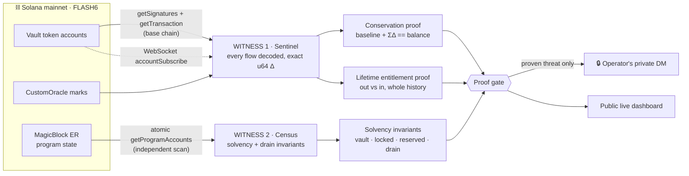

<div align="center">

# 🛰️ FLASH FLOW SENTINEL

### The world's first **dual-witness, proof-gated** watchtower over a live perps protocol.

**Every dollar in. Every dollar out. Proven against the chain — to the raw integer — by two independent witnesses that cross-check each other.**

[](https://solana.com)
[](https://nodejs.org)
[](https://pyth.network)
[](#-no-synthetic-data-ever)
[](#-the-alarm-doctrine--verify-then-speak)
[](#-the-defense-stack)
[](LICENSE)
[](https://flash-flow-sentinel.vercel.app)

**[🔗 Live Dashboard](https://flash-flow-sentinel.vercel.app)** &nbsp;·&nbsp; **[🔔 Alerts](https://t.me/FlashFlowSentinel)** &nbsp;·&nbsp; **[🛰️ Census](https://flashtrade-v2-onchain-census.vercel.app)**


</div>

---

## The 15-second version

> On **2026-07-21**, an attacker deposited **\$1** and withdrew **\$97,988** through a broken-entitlement path. The exchange's own conservation math was *blind* to it — because the money **moved correctly**; it just wasn't **authorized**.
>
> Flash Flow Sentinel is the answer. It watches every vault on-chain, in real time, and it **cannot be fooled the same way** — because it proves not just that money *moved*, but that whoever took it was *entitled* to it. And it does this from **two independent vantage points that check each other**.

**Don't trust. Verify. Twice.**

---

## 🛡️ The Defense Stack

Three layers. Every alarm is **verified on-chain before it fires** — never a raw "a threshold was crossed."

```
┌─────────────────────────────────────────────────────────────────────────┐
│  LAYER 1 · ATTACK DETECTION          proven-only, verified before alarm   │
│    • Over-withdrawal ....... full lifetime history traced on-chain         │
│    • Fresh-program deploy .. the program's actual deploy slot, read live   │
│    • Coordinated probes .... disposable wallets + a shared funder, proven  │
├─────────────────────────────────────────────────────────────────────────┤
│  LAYER 2 · CONTINUOUS INTEGRITY      re-proven every ~10 seconds           │
│    • Conservation (raw u64) . baseline + Σ deltas == balance, 0 tolerance  │
│    • Protocol solvency ...... census invariants: vault, locked, drain      │
│    • Oracle cross-check ..... on-chain mark vs an independent Pyth Lazer    │
│    • Governance / authority . upgrade keys, Squads, permission flags        │
│    • Phantom positions ...... baskets vs market collective_position         │
├─────────────────────────────────────────────────────────────────────────┤
│  LAYER 3 · AUTO-CONTAINMENT          proof-gated · signal, not authority   │
│    • A drain PROVEN on-chain → instant alert + signed pause-request to      │
│      Flash's own responder. The monitor holds NO pause key — by design.     │
└─────────────────────────────────────────────────────────────────────────┘
```

> **Why "signal, not authority"?** A monitor that can *halt* the protocol is a single point of compromise — hack the monitor, weaponize the halt. So Layer 3 **proves and signals**; the protocol's own authorized system acts. Detection is separated from authority *by construction*.

---

## 👁️👁️ Dual-witness: two independent scans that cross-check

Almost every monitor trusts **one** data source. This one runs **two**, from **different infrastructure**, and treats disagreement as an alarm.



If Witness 1's RPC ever *lied* about a drain, Witness 2 — reading completely different infrastructure — would still see the vault deficit. **A drain has to fool both, at once.**

---

## 🧮 The three proofs (this is why it can't lie)

### 1. Conservation — *"did we miss anything?"*
For every vault, every cycle, in raw `u64` with **zero tolerance**:

```
baseline_balance  +  Σ observed_tx_deltas  ==  live_vault_balance
```

Each delta is the exact integer difference of pre/post token balances *inside the transaction*. Miss one transfer and the residual is non-zero. The chain grades the monitor's homework, continuously.

### 2. Solvency — *"is the protocol still whole?"*
The census re-derives, from an **independent** on-chain scan, that after **all** flows:

```
SPL vault balance == owned + trade_payable − trade_receivable      (deficit: 0)
Σ custody.locked  == Σ position.locked_amount                       (exact u64)
```

…plus 10 critical money-drain invariants and per-custody withdrawable-solvency. Any single `false` = **provably insolvent → critical alarm.**

### 3. Entitlement — *"was this withdrawal authorized?"*
The one the \$1→\$98k exploit defeated. For any material withdrawer, the sentinel traces its **entire on-chain history** and proves it withdrew no more than it ever deposited — valued at real marks, with a *vault-counterparty* check so a laundering transfer can't fake a deposit. Validated against the **real attacker wallet** (proven) and a **real whale** (never touched).

---

## 🔔 The alarm doctrine — *verify, then speak*

Most monitors scream on every threshold blip. This one is silent until it has **proof**.

| | Old way | Flash Flow Sentinel |
|---|---|---|
| **A cap is crossed** | 🔴 "BREACH!" | Silent. It's just a *trigger* to go verify. |
| **A wallet withdraws big** | 🔴 "ALERT!" | Trace its whole history first. Entitled → silence. |
| **What reaches you** | noise | **only proven threats**, on-chain-verified |
| **Where** | public channel | **your private DM only** — can't leak to main *(enforced in code)* |
| **Repeats** | spam | latched — each threat alarms **once** |
| **When all is well** | pinging | one **live-status** message, *edited in place* every 60s (Telegram doesn't re-notify on edits → zero spam) |

Every card on the dashboard is tagged **`PROOF`** (verified on-chain, cannot false-fire) or **`RISK LIMIT`** (a heads-up, not proof). **Only proofs can trigger the auto-response.**

---

## 🎯 What it catches — and what no monitor can

| Threat | Caught by |
|---|---|
| Over-withdrawal (the \$98k exploit) | Layer 1 lifetime proof + Layer 2 solvency deficit |
| Oracle manipulation | Layer 2 independent Pyth Lazer cross-check |
| Governance / upgrade-authority takeover | Layer 2 authority diff |
| Phantom-position rehearsal | Layer 2 basket-vs-market recon |
| A slow drip under every velocity cap | Layer 1 (24h-cumulative proof) → Layer 2 solvency backstop |
| The monitor being blinded / silenced | dual-witness · dead-man heartbeat · watchdog · retrying private alarms |

> **The honest boundary.** This is a *detection* layer. A monitor cannot *physically stop* an on-chain transaction — only **Layer 0**, a circuit-breaker inside Flash's own program, can do that. Layer 3's signed webhook is precisely its trigger. We tell you the truth about what a watchtower can and cannot do.

---

## ⚙️ How every number is built (all real, on-chain)

- **State** — custodies / markets / oracles decoded from the program's **own on-chain Anchor IDL** via MagicBlock mainnet ER. No trading API, no `fstats`, no snapshots.
- **Flows** — `getSignaturesForAddress` on every program vault (custody vaults + TradeVault + RebateVault + staking + an auto-promoting sweep of every authority-owned token account), then `getTransaction` per new signature. Vault Δ = **exact u64** pre/post difference; counterparty = the same-mint account moving opposite in the same tx; kind from instruction logs. Internal vault→vault settlements excluded from user-flow numbers.
- **Push** — WebSocket `accountSubscribe` fires a ~1s decode the instant money moves, over a 12s baseline poll.
- **Valuation** — the on-chain `CustomOracle` mark at capture. Stale/paused markets show **MARKET IDLE** and never false-alarm.
- **Self-verification** — `verify.cjs` re-fetches random events straight from the chain and recomputes every window, bucket, and utilization from raw integers.

---

## 🚀 Quick start

```bash
npm install
cp .env.example .env        # add RPC_URL (a dedicated key recommended)
npm start                   # → http://127.0.0.1:4646

node verify.cjs             # independent re-verification of everything the dashboard claims
node test/containment.test.cjs   # proves Layer 3 vs the REAL attacker + a REAL whale
```

<details>
<summary><b>Configuration</b> (all optional — see <code>.env.example</code>)</summary>

| Var | Purpose |
|---|---|
| `RPC_URL` | base-chain RPC (signatures / txs / balances / WS) |
| `CENSUS_API_URL` | the second witness — on-chain solvency invariants |
| `LAZER_ACCESS_TOKEN` | use Pyth Lazer **directly** for the oracle cross-check |
| `OPERATOR_CHAT_ID` | **your private DM** — where every proven alarm + the live status go (never main) |
| `SECURITY_ALERTS=1` | arm the proven-only alarms |
| `CONTAINMENT=1` · `CONTAINMENT_WEBHOOK_URL` | arm Layer 3 auto-signal to your responder |
| `LIVE_STATUS=1` · `LIVE_STATUS_SEC` | the edit-in-place live status in your DM |
| `TELEGRAM_BOT_TOKEN` · `TELEGRAM_CHAT_ID` | bot + public withdrawal feed / digest channel |
| `HEARTBEAT_URL` | dead-man ping (silence ≠ safety) |
| `LIMITS_WRITE_TOKEN` | gate write endpoints on a public deploy |

</details>

---

## 🔒 No synthetic data. Ever.

No mock mode. No seeded fixture. No "representative" number anywhere. Every value on the dashboard is decoded from a real transaction on Solana mainnet and re-provable from the chain by anyone. **If it can't be verified on-chain, it isn't shown.**

---

<div align="center">

**[Dashboard](https://flash-flow-sentinel.vercel.app)** · **[Alerts](https://t.me/FlashFlowSentinel)** · **[Census](https://flashtrade-v2-onchain-census.vercel.app)**

Built on [Solana](https://solana.com) · Oracle by [Pyth Lazer](https://pyth.network) · Real-time via [MagicBlock](https://magicblock.xyz)

<sub><b>Dual-witness · proof-gated · proven-only alarms · 100% on-chain · MIT · self-verifying</b></sub>

</div>
